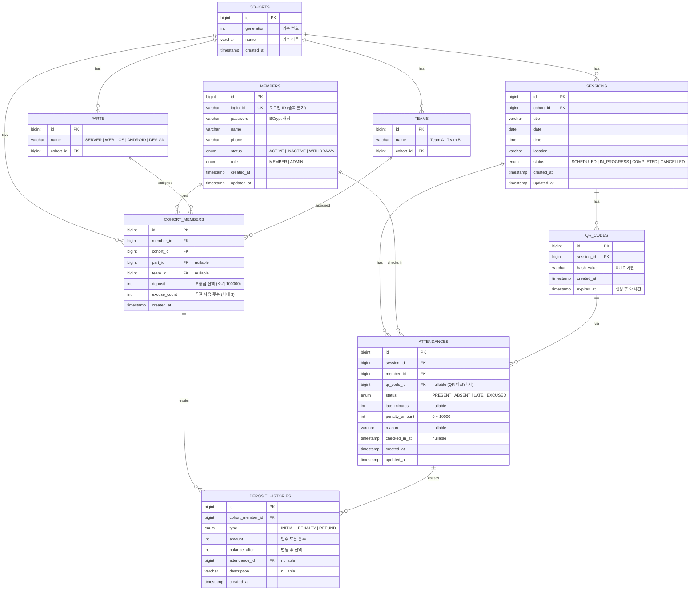

[← README](../README.md) | [시스템 아키텍처](SYSTEM_ARCHITECTURE.md) | [설계 결정](DECISIONS.md) | [AI 사용사례](AI_USAGE.md)

# ERD (Entity-Relationship Diagram)

## 테이블 관계 요약

| 관계 | 설명 |
|------|------|
| Cohort → Part | 기수별 파트 (SERVER, WEB, iOS, ANDROID, DESIGN) |
| Cohort → Team | 기수별 팀 (Team A, B, C) |
| Cohort → Session | 기수별 정기 모임 일정 |
| Member ↔ Cohort | CohortMember를 통한 다대다 (보증금, 공결 횟수 포함) |
| Session → QrCode | 일정당 QR 코드 (활성 1개 제한) |
| Session + Member → Attendance | 일정별 회원 출결 기록 |
| CohortMember → DepositHistory | 보증금 변동 이력 |
| Attendance → DepositHistory | 출결로 인한 패널티/환급 기록 |
