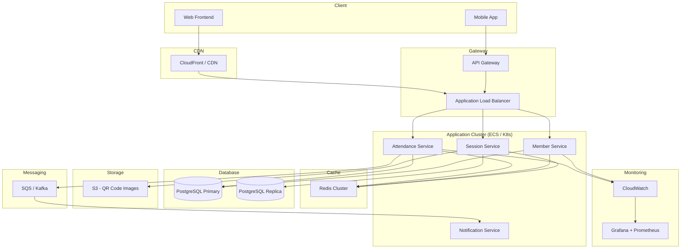
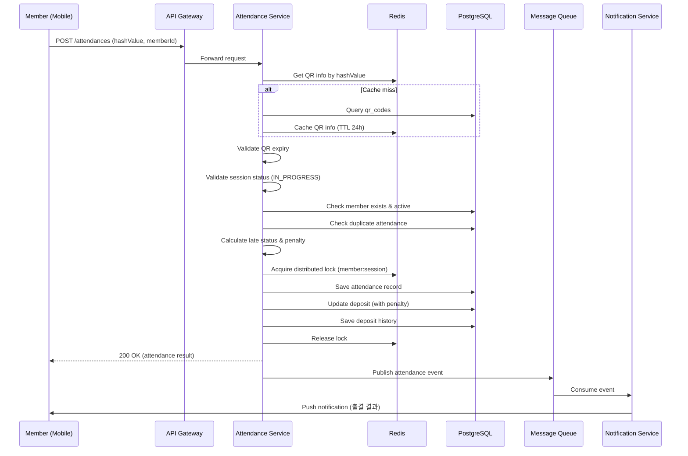

[← README](../README.md) | [ERD](ERD.md) | [설계 결정](DECISIONS.md) | [AI 사용사례](AI_USAGE.md)

# System Design Architecture

## 현재 구현 아키텍처

```
Client (Postman / Frontend)
    │
    ▼
┌─────────────────────────────────┐
│         Spring Boot 4.0         │
│  ┌───────────────────────────┐  │
│  │    Controller Layer       │  │
│  │  Auth / Member / Cohort   │  │
│  │  Session / Attendance     │  │
│  └───────────┬───────────────┘  │
│              │                  │
│  ┌───────────▼───────────────┐  │
│  │    Service Layer          │  │
│  │  비즈니스 로직 + 패널티 계산  │
│  │  보증금 자동 조정           │
│  └───────────┬───────────────┘  │
│              │                  │
│  ┌───────────▼───────────────┐  │
│  │    Repository Layer       │  │
│  │  Spring Data JPA          │  │
│  └───────────┬───────────────┘  │
│              │                  │
│  ┌───────────▼───────────────┐  │
│  │    H2 In-Memory DB        │  │
│  └───────────────────────────┘  │
└─────────────────────────────────┘
```

## 이상적인 프로덕션 아키텍처



## 아키텍처 설계 의도

### 1. 서비스 분리

| 서비스 | 책임 | 분리 이유 |
|--------|------|-----------|
| **Attendance Service** | QR 체크인, 출결 등록/수정, 패널티 계산 | 높은 동시성 (QR 스캔 시점에 집중) |
| **Member Service** | 회원 CRUD, 대시보드, 보증금 관리 | 데이터 일관성 중심 |
| **Session Service** | 일정/QR 코드 관리 | QR 생성과 일정 상태 관리 |
| **Notification Service** | 알림 (출결 결과, 패널티 안내) | 비동기 처리, 장애 격리 |

### 2. 핵심 설계 결정

**Redis 캐시 도입**
- QR 코드 유효성 검증: hashValue → sessionId 매핑 캐싱 (TTL 24h)
- 세션 상태 캐싱: 출석 체크 시 DB 부하 감소
- 보증금 잔액 캐싱: 동시 차감 시 분산 락 활용

**비동기 메시징 (SQS/Kafka)**
- 출결 등록 후 패널티 알림 비동기 발송
- 보증금 변동 이벤트 발행 → 이력 기록
- 서비스 간 느슨한 결합

**읽기 전용 레플리카**
- 대시보드, 출결 요약 등 조회 쿼리 분산
- Primary는 쓰기 작업에 집중

### 3. QR 출석 체크 상세 플로우



### 4. 보안 강화 방안 (프로덕션)

| 영역 | 현재 | 이상적 |
|------|------|--------|
| 인증 | 없음 (과제 요구) | JWT + Refresh Token |
| 인가 | URL 패턴 기반 | Spring Security RBAC |
| QR | UUID 해시 | TOTP 기반 시간 제한 해시 |
| 비밀번호 | BCrypt | BCrypt + Rate Limiting |
| API | 공개 | OAuth2 + API Key |

### 5. 확장성 고려사항

- **수평 확장**: Stateless 서비스 설계로 인스턴스 추가만으로 확장 가능
- **DB 샤딩**: 기수(generation) 기반 파티셔닝 가능
- **CQRS 도입**: 조회(대시보드, 요약)와 명령(출결 등록) 분리로 각각 최적화
- **이벤트 소싱**: 보증금 변동 이력을 이벤트 기반으로 관리하여 감사(Audit) 지원
